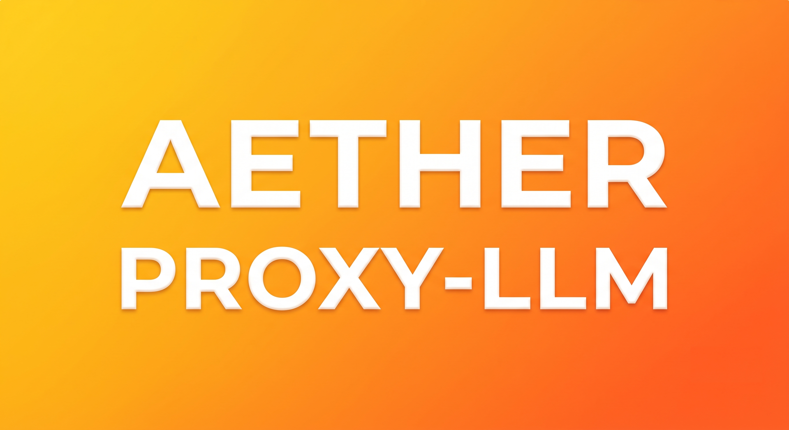

<div align="center">
  
  
# Aether Proxy LLM
  
  **Nunca pare de codar. Economize até 40% de tokens com compressão inteligente (RTK) e roteamento automático para modelos GRÁTIS e acessíveis.**

  [](https://github.com/nickcatsshild/Aether-Proxy-LLM-Releses/releases)
  [](https://hub.docker.com/r/catsavengers/aether-proxy-llm)
  [](LICENSE)

  [🚀 Comece Agora](#-como-instalar) • [⚙️ Recursos](#-recursos-principais) • [🧠 Modelos Suportados](#-provedores-e-modelos) • [📚 Wiki](https://github.com/nickcatsshild/Aether-Proxy-LLM-Releses)
</div>

---

## ⚡ Por que usar o Aether Proxy LLM?

Diga adeus às interrupções no meio do seu fluxo de trabalho porque a cota da sua assinatura de IA acabou. O **Aether Proxy LLM** atua como um roteador inteligente entre suas ferramentas de desenvolvimento (Cursor, Copilot, Cline, etc.) e os provedores de IA.

- **Economia Massiva (RTK):** Comprime automaticamente logs gigantescos (como `git diff` ou `ls`), economizando até 40% dos seus tokens antes mesmo de chegarem na IA.
- **Roteamento 3-Tier Inteligente:** Se a cota da sua IA Primária (ex: Claude) esgotar, ele cai automaticamente para uma IA Secundária mais barata (ex: GLM-5) e, se necessário, para uma IA Gratuita. Zero downtime.
- **Chaves de API + Combos:** Crie planos de modelos personalizados e limite chaves de API a combos específicos para controlar seus custos com máxima eficiência.
- **Acesso em Rede Local (LAN):** O servidor agora roda nativamente em `0.0.0.0`, permitindo que qualquer outra máquina ou IDE na mesma rede possa utilizar o seu proxy Aether (ótimo para times ou setups multi-dispositivos).
- **Portabilidade Total:** Rode localmente no Windows com um único `.exe`, em Linux com nosso `.deb` ou em servidores/NAS via Docker e CasaOS. Onde você estiver, o Aether estará.

---

## 🚀 Como Instalar

Temos 3 versões disponíveis para você escolher a que melhor se adapta ao seu ambiente:

### 1️⃣ Windows Portable (Recomendado para uso local)

Ideal para desenvolvedores que querem rodar o Aether na própria máquina de forma isolada, sem sujar o sistema.

1. Acesse a aba **Releases** aqui no GitHub.
2. Baixe o arquivo `Aether-Windows-Release.zip`.
3. **IMPORTANTE:** Extraia o arquivo `.zip` para uma pasta de sua escolha (ex: `C:\Aether`).
4. Clique duas vezes no arquivo `Aether.exe` para executar. **Pronto!** *(Não exige NodeJS, Python ou Docker).*

### 2️⃣ Docker & CasaOS (Recomendado para NAS/Servidores)

Perfeito para rodar 24/7 na sua rede local ou em uma VPS.

- **Docker Compose (Recomendado):**
  Use o arquivo `docker-compose.yml` que está na pasta `docker/` deste repositório, ou crie um arquivo e cole o código abaixo. Depois, execute `docker-compose up -d`.

  ```yaml
  version: "3.8"
  services:
    aether-proxy-llm:
      image: catsavengers/aether-proxy-llm:latest
      container_name: aether-proxy-llm
      ports:
        - "20128:20128"
      volumes:
        - /DATA/AppData/aether/data:/app/data
      environment:
        - DATA_DIR=/app/data
      restart: unless-stopped
  ```

- **CasaOS:** Basta colar o código do `docker-compose.yml` acima, ou usar o arquivo da pasta `docker/` na App Store do seu CasaOS (importar arquivo).

- **Docker Nativo:**

  ```bash
  docker run -d \
    --name aether-proxy-llm \
    -p 20128:20128 \
    -v "$HOME/.aether-proxy-llm:/app/data" \
    -e DATA_DIR=/app/data \
    catsavengers/aether-proxy-llm:latest
  ```

### 3️⃣ Pacote Linux (.deb)

Para usuários raiz de Ubuntu/Debian:

1. Baixe o pacote `.deb` na aba de Releases.
2. Instale via terminal: `sudo dpkg -i aether-proxy-llm_latest_amd64.deb`

> 🌐 Após rodar qualquer versão, o painel de controle estará disponível em: **<http://localhost:20128>**

---

## 🛠 Como usar nas suas ferramentas

O Aether emula a API da OpenAI. Isso significa que ele é **100% compatível** com praticamente qualquer ferramenta moderna de código assistido por IA.

**Configuração Padrão para sua IDE/Ferramenta:**

- **URL Base da API (Endpoint):** `http://localhost:20128/v1`
- **Chave de API (API Key):** Crie uma no painel do Aether, na aba "Endpoint".
- **Modelo:** Selecione o modelo que deseja usar ou o nome do seu *Combo* personalizado.

### 🔌 Suporte Nativo

- **Cursor IDE:** `Configurações → Modelos → Avançado → Substituir URL da OpenAI`
- **Claude Code:** Altere o `anthropic_api_base` no arquivo `~/.claude/config.json`.
- **Extensões VSCode:** Cline, RooCode, Continue, etc.
- **Ferramentas CLI:** OpenClaw, Codex, Copilot CLI, Devin, Grok Build.

---

## 🧠 Provedores e Modelos

O Aether se conecta com **+40 provedores** diferentes e suporta centenas de modelos. Abaixo estão as melhores opções para configurar no seu painel:

### 🎁 Provedores Gratuitos (Comece sem gastar nada)

- **Kiro AI:** Oferece modelos como *Claude 3.5 Sonnet*, *GLM-5* e *MiniMax* de forma gratuita (~50 créditos/mês). Login via GitHub ou Google.
- **OpenCode Free:** Modelos rotativos 100% gratuitos sem necessidade de conta ou login.
- **Vertex AI (Google Cloud):** Ganhe $300 dólares de crédito em novas contas para usar Gemini 1.5 Pro e GLM-5.

### 💰 Provedores Ultra-Baratos (Backup perfeito)

- **GLM-5.1:** Apenas $0.60 por 1 Milhão de tokens.
- **MiniMax M2.7:** Apenas $0.20 por 1 Milhão de tokens.
- **Kimi K2.5:** Plano fixo e acessível.

### 💎 Provedores Premium

Conecte diretamente suas chaves da **OpenAI**, **Anthropic**, **OpenRouter**, entre dezenas de outros serviços para usá-los como Tier 1.

---

## ⚙️ Recursos Principais e Combos

O verdadeiro poder do Aether está nos **Combos (Planos de Tokens)**. No painel, você pode agrupar vários modelos em uma única fila lógica.

**Como funciona na prática?**

1. Você cria um combo chamado `dev-backend`.
2. Adiciona o **Claude 3.5 Sonnet (Premium)** como #1.
3. Adiciona o **GLM-5 (Barato)** como #2.
4. Adiciona o **OpenCode (Grátis)** como #3.
5. Gera uma Chave de API atrelada a este combo.
6. **Resultado:** Sua IDE fará a requisição. Se o Claude falhar (limite de uso), o Aether envia para o GLM silenciosamente. Você não perde seu código e não precisa parar para trocar chaves na IDE!

---

## 🔒 Segurança e Sincronização

- Seu histórico, chaves de API e configurações ficam salvas localmente no seu banco de dados SQLite (`DATA_DIR`).
- Se preferir, é possível utilizar o recurso de **Cloud Sync** para manter instâncias do Aether sincronizadas entre seu PC e seu Servidor/NAS.

---

<div align="center">
  <i>Desenvolvido a basé de café.</i><br/>
  <b>Proibido a venda, você pode usar nossa versão sem tempo limite. Não há garantia, o projeto pode ser encerrado caso não possua colaboradores, em fim essa é a vida.</b>
</div>
